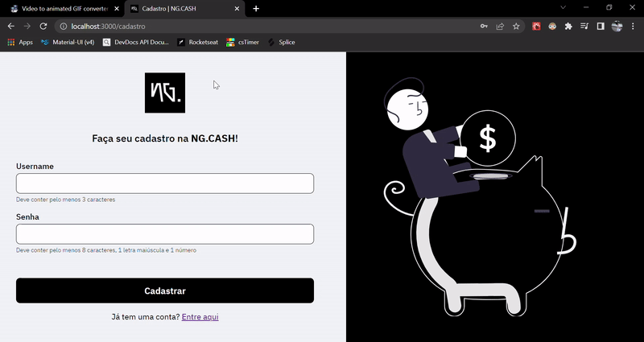
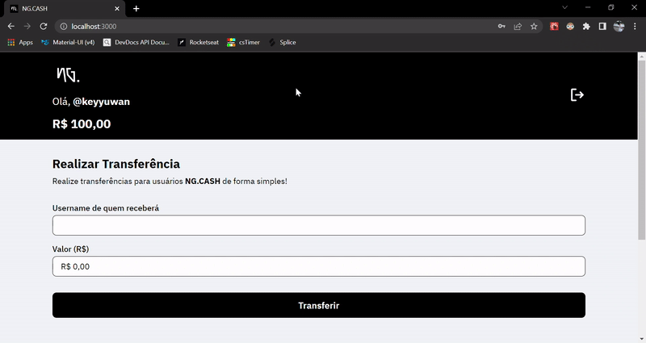

# Processo Seletivo NG.CASH

O teste deste processo seletivo consistiu em criar uma aplicação FullStack de transações financeiras.

- Diretório **/web** - onde está todo o código Front-end da aplicação e instruções de como rodar

- Diretório **/api** - onde está todo o código Back-end da aplicação e instruções de como rodar

## Overview:

## Tecnologias

### 🖥️ Front-end:

#### - ReactJS

#### - TypeScript

#### - Styled Components

#### - Next.js

### ⚙️ Back-end:

#### - Node.js

#### - TypeScript

#### - Express

#### - Prisma

#### - PostgreSQL
